# What is Machine Learning

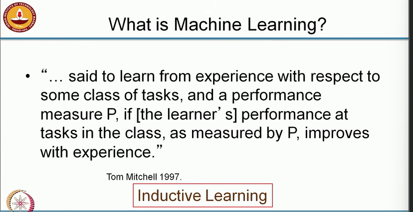

## ML Paradigms

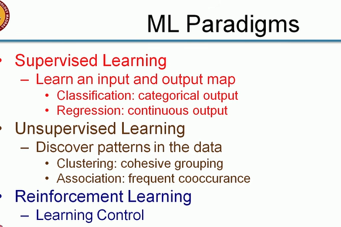

## Machine Learning Tasks

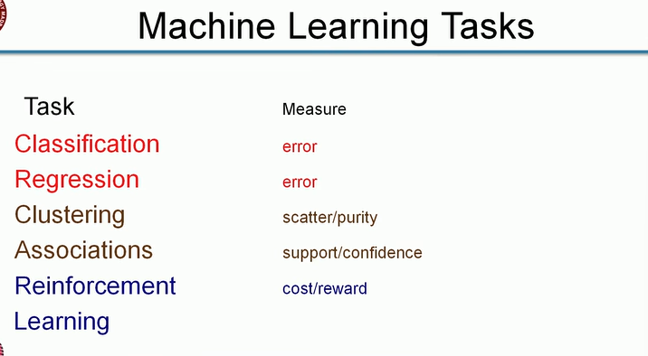

## Challenges

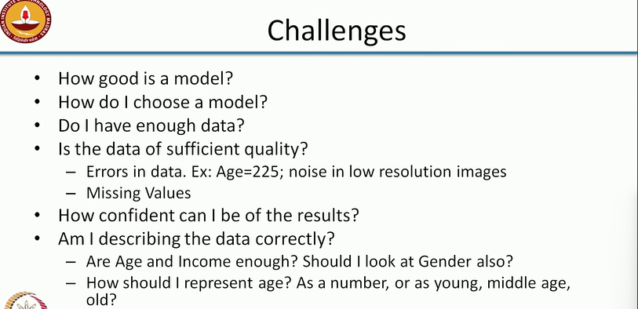

# Lecture 2

In this module we will look at supervised learning.

## Supervised Learning

> In this case let us assume I have customer database and I am describing that by two attributes age and income. So I have each customer that comes to my shop I know the age of the customer and the income level of the customers. And my goal is to predict whether the customer will buy a computer or not buy a computer 

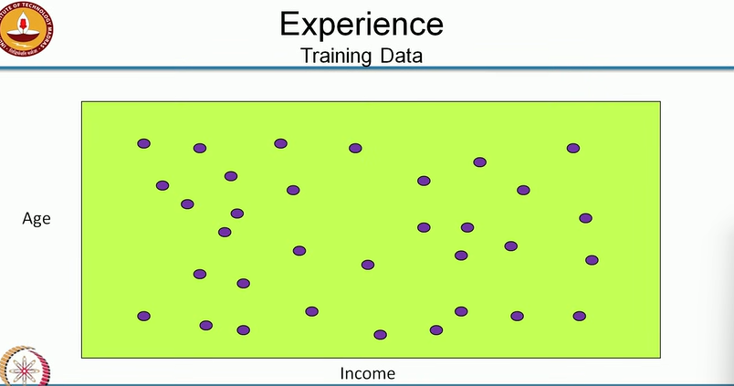

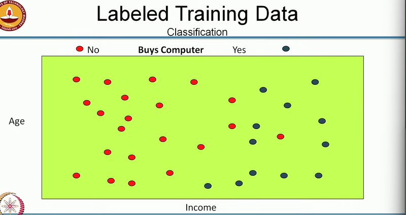

* **Possible Classifiers**

> Left of line will not buy a computer and right of the line will buy a computer
> So it basically says that if the income of the person is less than some value, person will not buy a computer and if the value is greater than X the person will buy your computer

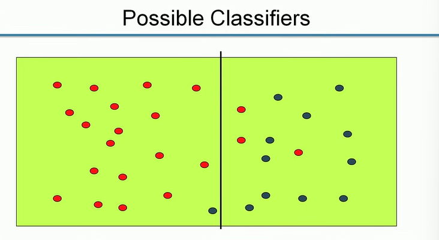

> younger means lower on the y axis, so the younger you are , the income threshold at which you buy a computer is lower
> Older you are, the income threshold is shifted to the right

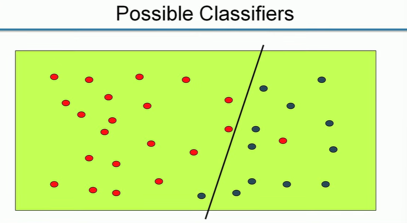

> Now here I have quadratic and 3 parameters and getting better performance
> We get much better performance but the cost of having a more complex classifier

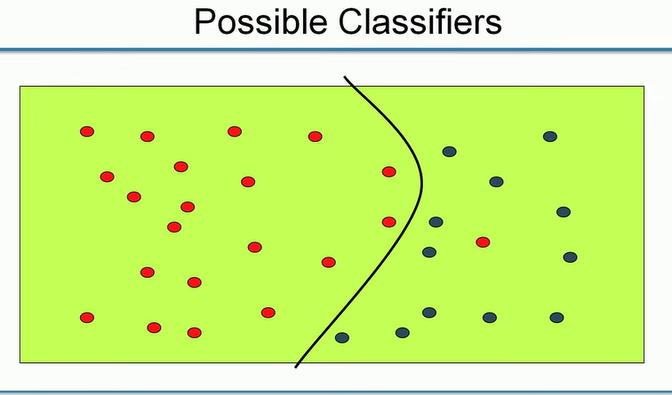

can we do better than above? yes

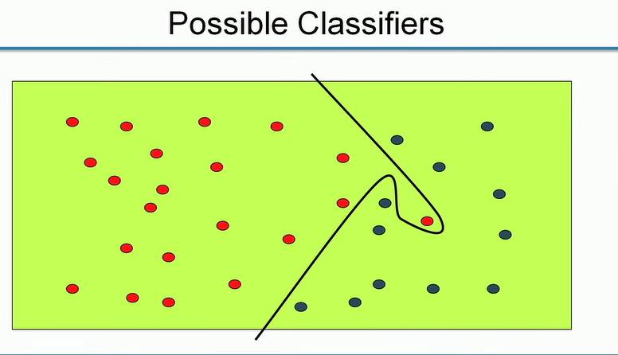

why that one red noise occured ? may be because customer might have got called or some emergency and left

> So these are the kind of issues that we have to think about. what is the complexity of the classifier vs the accuracy of the classifier. 

## Inductive bias

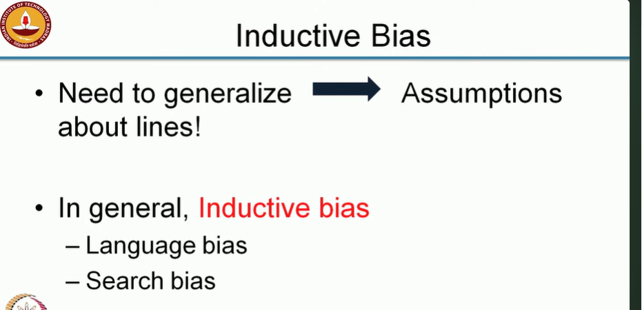

## The Process

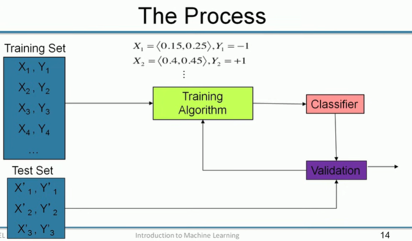

> So what happens in that training algorithm

## Training

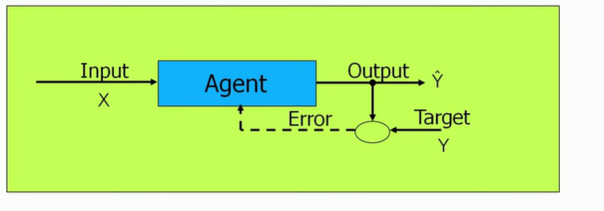

## Applications

* Credit Card fraud detection
    * Valid transaction or not
* Sentiment Analysis
    * Opinion mining; buzz analysis; etc.
* Churn prediction
    * Potential churner or not
* Medical diagnoses
    * Risk analysis

## Prediction or Regression

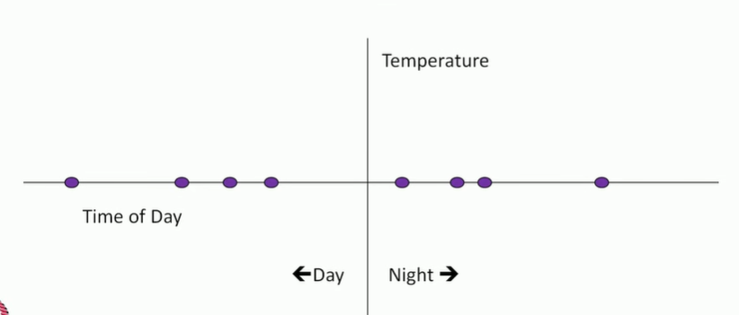

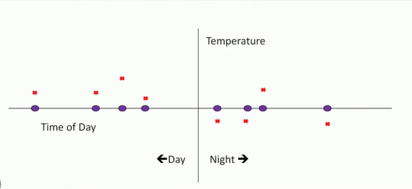

> Blue points are inputs and red you are expected to predict

* Simplest solution

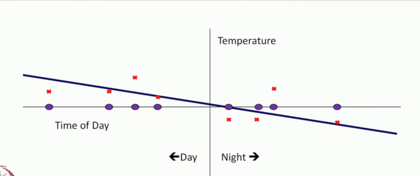

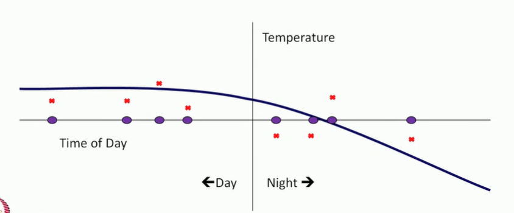

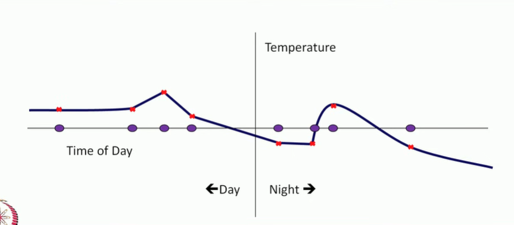

So above kind of solutions where we are trying to fit the noise in the data , we are trying to make the solution predict the noise in the training data correctly is known as over fitting

## Linear regression

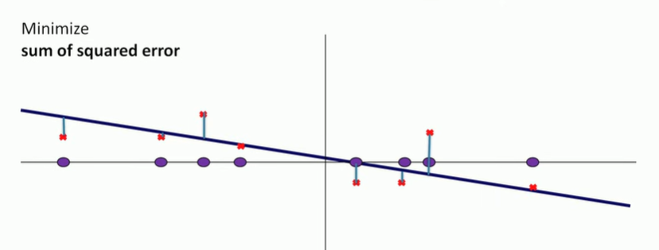

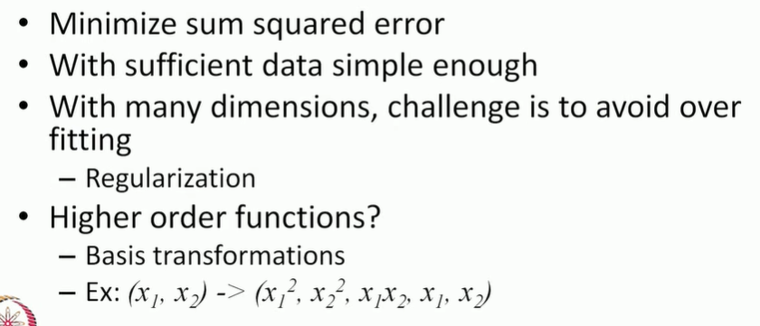

## Linear regression applications

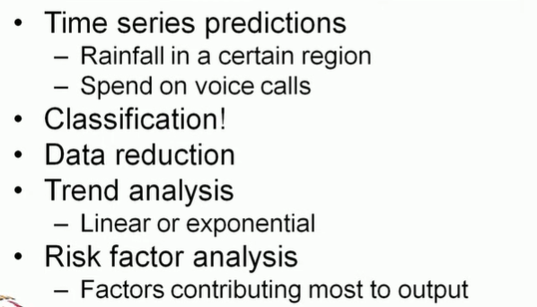

# Lecture 3 - Unsupervised learning

* data do not have label attached to it

## Clustering

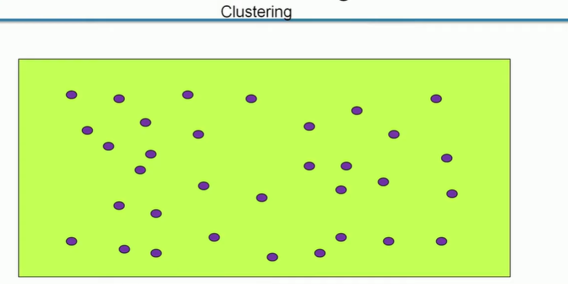

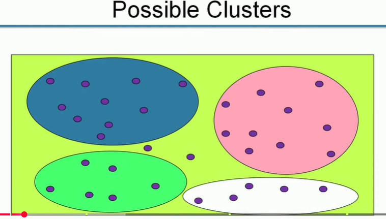

* Need not take outliers while clustering
* only form which are cohesive groups of points 